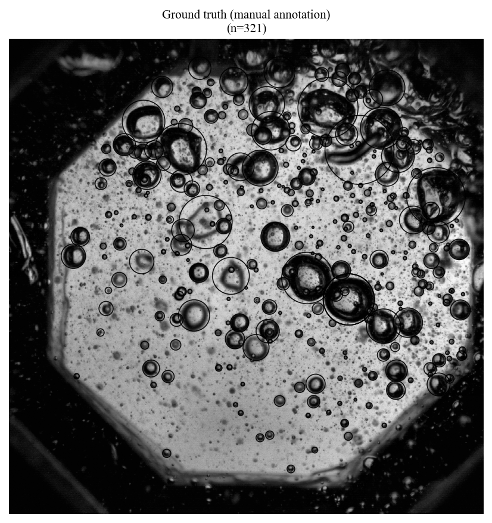
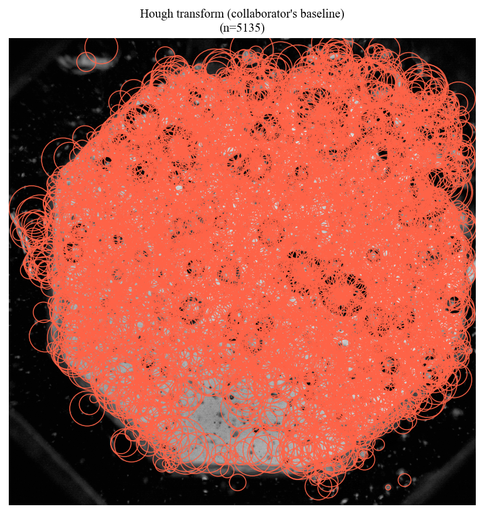
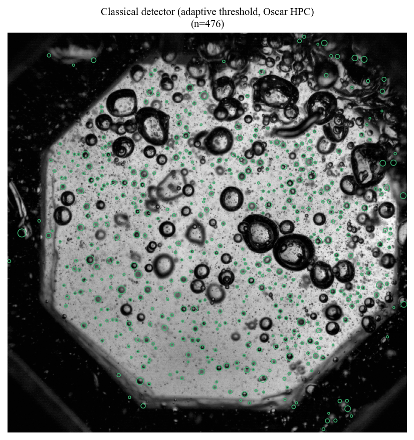
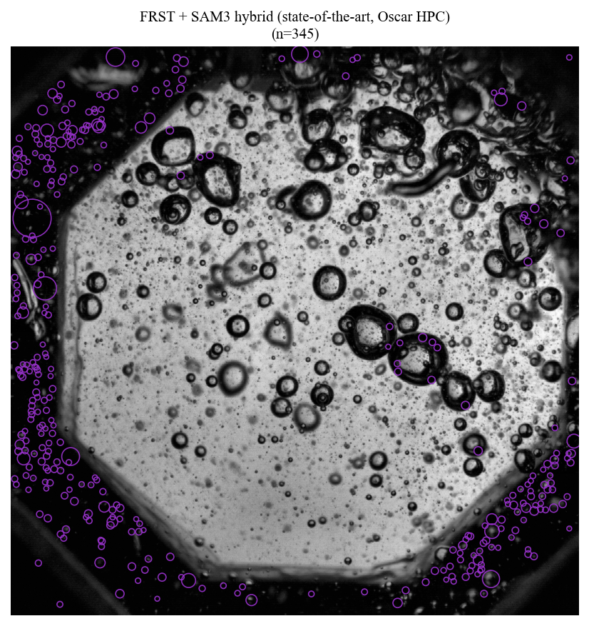
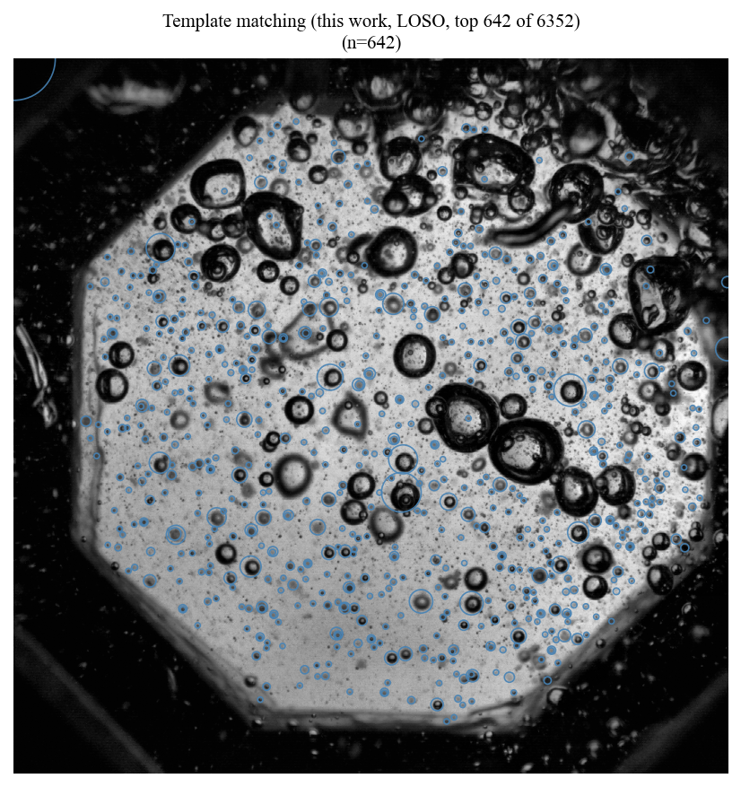

# Bubble Counting — Condensed Summary

*Full experiment-by-experiment log with raw numbers, scripts, and PAL consensus notes: [`experiments.md`](experiments.md). This document is a condensed synthesis of that log (E1–E16, Rank 9, Experiments A–D, O1–O3) as of 2026-05-03. It does not cover the later MATLAB-figure / Oscar-detector comparison work (see repo `output/` and `scripts/*matlab*`, `scripts/*gt_all14*`), which has not yet been logged into `experiments.md`.*

## Problem & KPI

Predict a bubble size histogram (27 log-spaced radius bins) from a single static image. **relL1** = `sum|pred_bin − gt_bin| / sum(gt_bin)`, lower is better. Target relL1 ≤ **0.20** (revised down from 0.10 on 2026-05-03, user-approved).

## Facts (measured, not interpreted)

| Approach | relL1 (LOSO/LOO median) | Raw measurement |
|---|---|---|
| GT-oracle lookup (mean/median of other images' histograms) | **0.657** | Reference floor — requires GT access, not deployable |
| NCC template-matching pipeline (this repo's main method) | **0.851** | Loses to oracle on 9/12 stable images |
| Per-level independent NMS (no cross-scale competition) | 23.080 | 24× over-prediction |
| Full-image Hough transform | n/a | 11% of detections within 2 pyramid levels of GT; 771–2430 FP/image |
| FRST / Loy-Zelinsky radial symmetry (18-radius sweep) | 0.932 | Worse than the 0.851 NCC pipeline |
| Multi-annulus radial-gradient classifier (best detection variant) | n/a | SNR = 3.0014× (raw, in-sample); recall ≈53% of GT bubbles proposable at usable tolerance |
| Image-feature ridge regression (37 features incl. radial-gradient integral) | 0.681 | Wilcoxon signed-rank vs. oracle: p=0.589 |
| Within-session / regime-conditional oracle | 0.628–0.44 across partitions | Best partition n=2–3 images |

**Note:** the *conclusions* drawn from these raw numbers (e.g. "marginal → closed" for the multi-annulus classifier, "no signal" for ridge regression) required a post-hoc PAL-consensus correction in every case — each experiment's own automated script initially reported PASS or MARGINAL using a threshold that was later judged too lenient (in-sample bias, wrong statistical test, or a post-hoc-introduced MARGINAL zone not in the pre-committed criterion). See `experiments.md` for the reasoning chain behind each reversal; treat the table above as raw measurements, not as the final verdicts.

Structural numbers behind the falsifications:
- NCC: 95% of GT bubbles have a correct-scale response peak in the raw score map; cross-scale NMS discards 88% of them before calibration ever sees them.
- LoG: per-bubble scale-space peak location has IQR ≥ 6 pyramid levels (of ±6 measured) — no fixed σ localizes correctly across the population.
- Radial-gradient rim signal: 6.86× SNR at *oracle-known* bubble centers, collapsing to 1.2–3.0× once measured on real generator candidates in a dense field (candidate density 300–600 bubbles/image); 31–78% of inter-bubble (non-bubble) candidates score above the true-bubble median depending on profile design.
- Ridge regression: feature importance is dominated by img_mean/std/kurtosis (photometric-regime identity), not histogram-shape predictors.

## Interpretation (why, and what's left)

**Root cause is scale-selectivity, not feature quality.** NCC, LoG, and Hough all fail for structurally different reasons that converge on the same problem: none produces a response that peaks at the *correct* bubble scale independent of local image texture. NCC's response is monotonically biased toward finer scales (more image texture → higher score) with no peak at all. LoG's peak location is scattered by ±6 levels; the dataset appears to contain four distinct bubble morphologies (54% dark-rim, 27% filled-dark, 12% bright-rim, 8% indeterminate — small sample, n=26 bubbles, 95% CI on the dominant category is a wide [34%, 72%], preliminary only) that would each demand a different optimal σ and sampling location, which — if the prevalence estimate holds up — is one plausible reason no single fixed-parameter feature covers the population. Full-image Hough is swamped by apparatus-edge votes (accumulator noise, not a morphological failure — patch-based Hough was never tested and remains open in principle).

**The dense-field regime, not data scarcity, is the binding constraint for detection.** The "14 images is too little data" framing is wrong for *local* patch classifiers: 14 images yield ~5,000 annotated bubble instances, enough to overdetermine a logistic regression by an estimated ~250×. The real ceiling is generator recall and inter-bubble ambiguity at 300–600 bubbles/image: any local feature that discriminates a real bubble rim from background also fires on the boundary between two touching bubbles, and geometric NMS cannot cleanly separate them at this density. This is why the best detection variant (multi-annulus radial gradient) hit a hard recall ceiling (~53% of bubbles proposable at usable positional tolerance) rather than a feature-quality ceiling.

**Session and photometric-regime conditioning add no signal.** Cross-image histogram variance is dominated by per-image content, not apparatus state — within-session and brightness-quartile oracles both failed to beat the global oracle beyond statistical noise (n=2–3 per partition).

**Consensus verdict (PAL + Claude, 2026-05-03): all classical handcrafted-feature and linear-regression paths are closed.** Two paths remain open, both requiring investment beyond feature engineering:
1. **Exemplar-conditioned counting** (FamNet/DAVE-style) — conditions the estimator on crops from the test image itself, which sidesteps the 4-regime photometric heterogeneity problem by construction. Not yet probed; highest estimated probability of reaching target (5–10%) among untested paths.
2. **More annotated data.** Every regression/CNN path's success probability is gated by dataset size (n=14 sessions); ~20 additional annotated images is the single highest-leverage action identified across the whole campaign, independent of which architecture is chosen next.

## Segmentation snapshot

Qualitative only — same GT image (`C1S0014_img006001`, n_gt=321) segmented by five methods; see `output/seed_v04_gt_all14/` and `output/test17_zerog_opt3/` for the quantitative relL1/count comparisons these methods were later run through.

**Ground truth (manual annotation)**

**Hough transform (collaborator's baseline)**

**Classical detector (adaptive threshold, Oscar HPC)**

**FRST + SAM3 hybrid (state-of-the-art, Oscar HPC)**

**Template matching (this work, LOSO, top NCC survivors after 3D NMS)**

